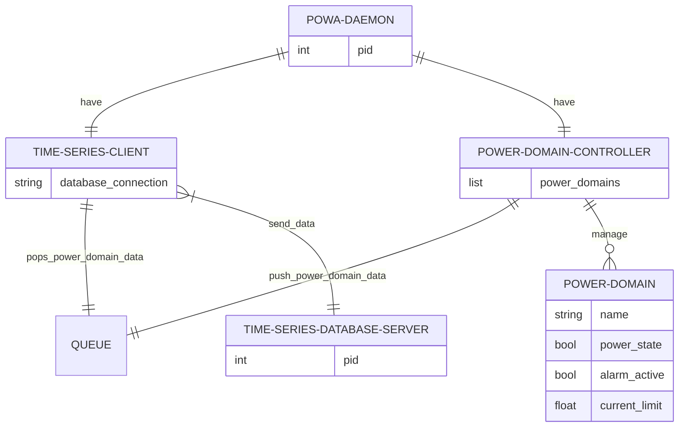

# Power Warden application architecture

Powa daemon is composed by:

- a time-series database client, which takes data from a queue and sends it to a time-series database server.
- a power-domain controller, which can manage several power domains. The power-domain controller pushes data to a queue.

